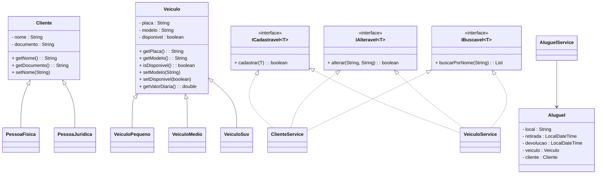

# 🚗 ADA LocateCar - Locadora de Veículos

## 📌 Descrição
Este projeto foi desenvolvido como parte do programa **Ada Tech + Mercado Livre Desenvolva+**, com o objetivo de aplicar conceitos de **Programação Orientada a Objetos (POO)** e **princípios SOLID** no gerenciamento de uma **locadora de veículos**.

O sistema permite cadastrar veículos e clientes (Pessoa Física e Jurídica), realizar aluguéis e devoluções de veículos, aplicar regras de desconto e manter a consistência dos dados.

---

## 🎯 Funcionalidades
- **Veículos**
    - Cadastrar veículos (PEQUENO, MÉDIO, SUV)
    - Alterar dados de um veículo cadastrado
    - Buscar veículos pelo nome/modelo

- **Clientes**
    - Cadastrar clientes (Pessoa Física e Jurídica)
    - Alterar dados de clientes

- **Aluguéis**
    - Alugar veículos (respeitando disponibilidade)
    - Devolver veículos com cálculo de diárias e descontos
    - Registrar local, data e hora de retirada e devolução

- **Menu interativo no console**

---

## 📜 Regras de Negócio
1. Veículos não podem ter placas repetidas.
2. Clientes não podem ter CPF/CNPJ repetidos.
3. Veículos alugados ficam indisponíveis até a devolução.
4. Aluguéis com horas fracionadas contam como **uma diária inteira**.
5. Descontos aplicados:
    - Pessoa Física: **5%** após 5 diárias.
    - Pessoa Jurídica: **10%** após 3 diárias.

---

## 💰 Tabela de Preços
| Tipo de Veículo | Valor da Diária |
|-----------------|-----------------|
| PEQUENO         | R$ 100,00       |
| MÉDIO           | R$ 150,00       |
| SUV             | R$ 200,00       |

---

## 🛠️ Tecnologias Utilizadas
- **Java 17+**
- **Paradigma de Orientação a Objetos**
- **Interfaces e Generics**
- **LocalDateTime e ChronoUnit**
- **Collections (Map, List)**

---

## 📂 Estrutura do Projeto

```
src/
├── models/
│ ├── Aluguel.java
│ ├── Cliente.java
│ ├── PessoaFisica.java
│ ├── PessoaJuridica.java
│ ├── Veiculo.java
│ ├── VeiculoPequeno.java
│ ├── VeiculoMedio.java
│ ├── VeiculoSuv.java
├── services/
│ ├── AluguelService.java
│ ├── ClienteService.java
│ ├── VeiculoService.java
│ ├── ICadastravel.java
│ ├── IAlteravel.java
│ ├── IBuscavel.java
├── Main.java
```

---

## 📊 Diagrama UML


---
## ✅ Facilidade e Dificuldade na Implementação
Facilidade

- Herança e Polimorfismo: Criação da hierarquia Cliente (abstrata) → PessoaFisica/PessoaJuridica e Veiculo (abstrata) → VeiculoPequeno, VeiculoMedio, VeiculoSuv.

- Interfaces Específicas (ISP): Divisão em ICadastravel, IAlteravel e IBuscavel fez cada serviço implementar apenas o necessário.

- Encapsulamento: Uso de atributos privados e métodos getters/setters deu segurança ao acesso.

- Uso de Map: Estrutura ideal para evitar duplicidade de CPF/CNPJ e placas.

Dificuldade

- Regras de Negócio: Cálculo de diárias fracionadas e descontos específicos exigiram bastante cuidado.

- Controle de Datas: Trabalhar com LocalDateTime e ChronoUnit foi desafiador, principalmente para validar a entrada no formato dd/MM/yyyy HH:mm.

- Validação de Cliente: Garantir unicidade de CPF/CNPJ e vincular corretamente ao objeto Cliente deu bastante trabalho.

- Menu Principal: A lógica no Main ficou extensa, misturando entrada de dados com regras de negócio. Uma melhoria futura seria implementar um Controller ou interface gráfica.

--- 

## ▶️ Como Executar

Clone este repositório:

```
git clone https://github.com/Gabrielgqa/AdaLocateCar.git
```

Compile o projeto:

```
javac src/Main.java
```

Execute a aplicação:

```
java src.Main
```